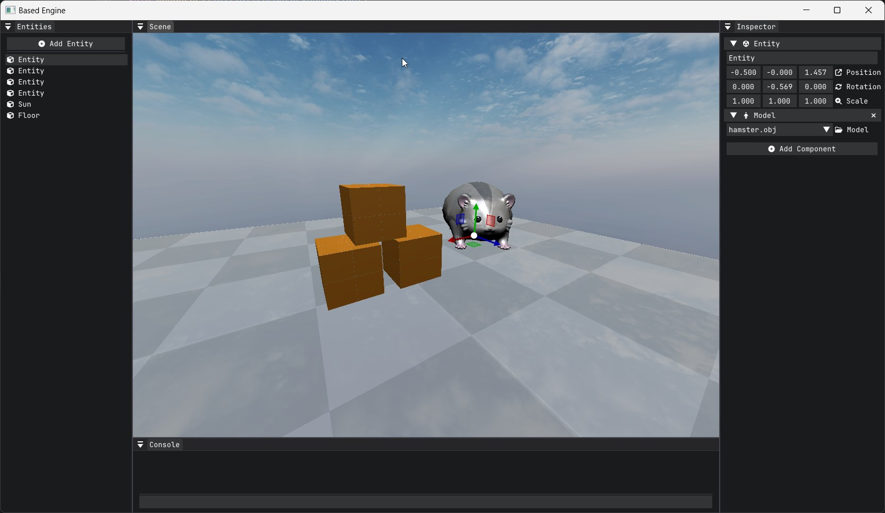

# Based Engine

Based on what? Based Engine is a 3D DirectX 11 "engine" written in modern C++. The goal is to create a 3D playground that allows me to easily interact and implement various graphics features.

[The previous iteration of this project used OpenGL](https://github.com/matekdev/based-engine-opengl). After implementing shadow maps, I felt confident enough to switch to DirectX 11. I plan to reimplement the previous features done in OpenGL and continue adding new ones as well. At some point I plan to transition over to DirectX 12 using [D3D11On12](https://learn.microsoft.com/en-us/windows/win32/direct3d12/direct3d-11-on-12) but that is only after I feel limited by DirectX 11.

- [PhysX integration](https://matek.dev/blog/basedlogs-19/)
- [Object Picking](https://matek.dev/blog/basedlogs-19/)
- Model loading

## Libraries

- [PhysX](https://github.com/NVIDIA-Omniverse/PhysX)
- [glm](https://github.com/g-truc/glm)
- [glfw](https://github.com/glfw/glfw)
- [assimp](https://github.com/assimp/assimp)
- [entt](https://github.com/skypjack/entt)
- [glog](https://github.com/google/glog)
- [imgui](https://github.com/ocornut/imgui)
- [imguizmo](https://github.com/CedricGuillemet/ImGuizmo)
- [IconFontCppHeaders](https://github.com/juliettef/IconFontCppHeaders)
